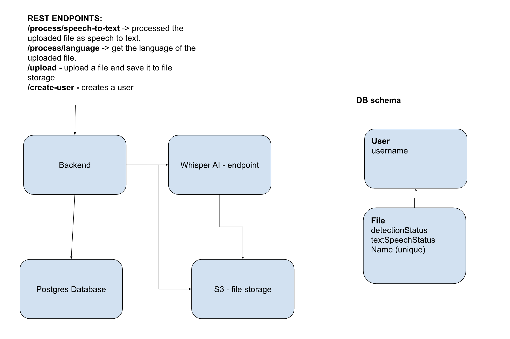

# Reality Defender Assessment

## Architecture



## Running Local Docker Compose

```
docker compose build
docker compose up -d
```

## API

#### Creating a user

```
curl http://localhost:8080/create-user \
    --include \
    --header "Content-Type: application/json" \
    --request "POST" \
    --data '{"username": "test"}'
```

#### Uploading a file

```
curl -X POST http://localhost:8080/upload\?username\=test\&filename\=audio.mp3 \
  -F "file=@/Users/nicholasfix/dev/reality-defender-assessment/ai/audio.mp3" \
  -H "Content-Type: multipart/form-data"
```

#### Calling Speech to text

Call socket endpoint

```
ws://localhost:8080/process/speech-to-text?filename=audio.mp3&username=test
```

#### Calling Language Detection

Call socket endpoint

```
ws://localhost:8080/process/language?filename=audio.mp3&username=test
```
